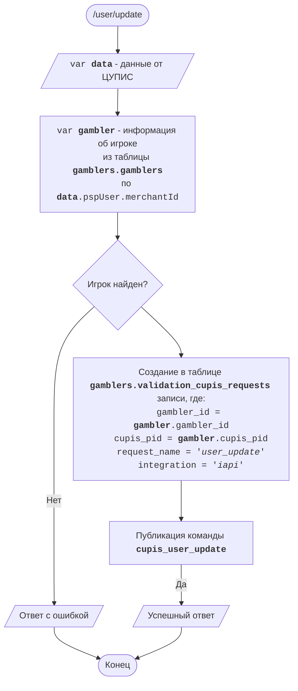
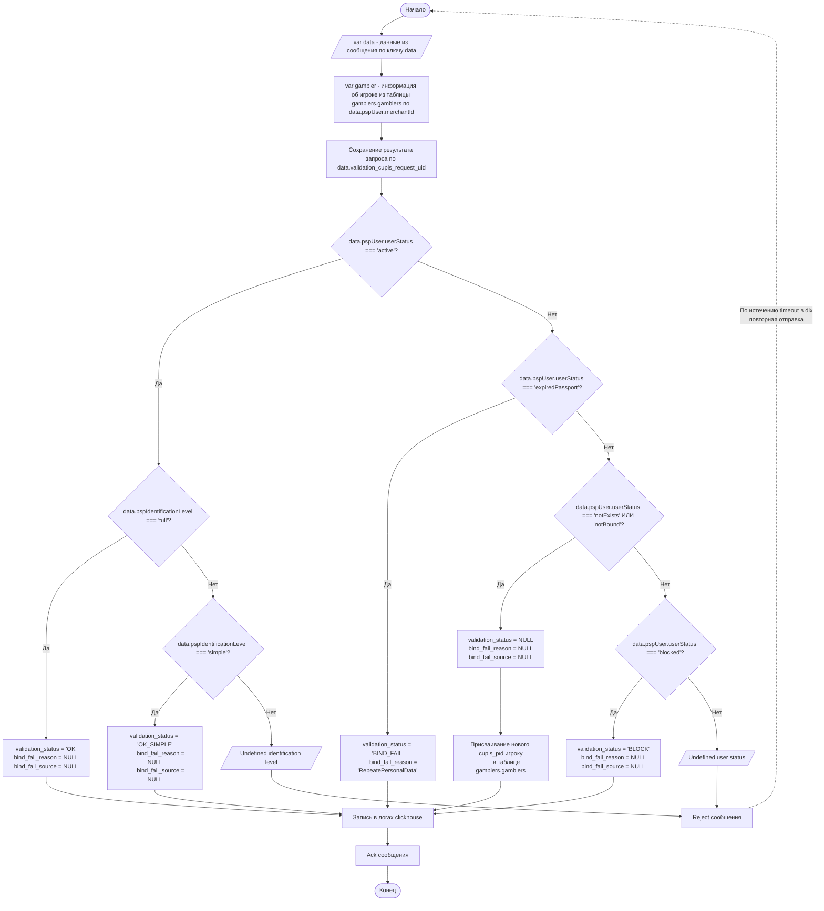

### Изменение информации о пользователе
#### Получение данных от ЦУПИС (Webhook)

```mermaid
graph TD
    Start
        --> Input
        --> UserGetting
        --> UserCheck

    UserCheck
        --> |Нет| ResponseError
        --> End

    UserCheck
        --> CreateValidationRequest
        --> UserUpdateCommand
        --> |Да| ResponseSuccess
        --> End


    Start(["/user/update"])
    End(["Конец"])
    Input[/"
        <code>var <b>data</b></code> - данные от ЦУПИС
    "/]
    UserGetting["
        <code>var <b>gambler</b></code> - информация об игроке
        из таблицы <code><b>gamblers.gamblers</b></code>
        по <code><b>data</b>.pspUser.merchantId</code>
    "]
    UserCheck{"Игрок найден?"}
    CreateValidationRequest["
        Создание в таблице <code><b>gamblers.validation_cupis_requests</b></code> записи, где:
        <code>gambler_id = <b>gambler</b>.gambler_id</code>
        <code>cupis_pid = <b>gambler</b>.cupis_pid</code>
        <code>request_name = '<i>user_update</i>'</code>
        <code>integration = '<i>iapi</i>'</code>
    "]
    UserUpdateCommand["Публикация команды <code><b>cupis_user_update</b></code>"]
    ResponseError[/"
        Ответ с ошибкой
    "/]
    ResponseSuccess[/"
        Успешный ответ
    "/]
```

#### cupis_user_update command

```mermaid
graph TD
    Start
        --> Input
        --> UserGetting
        --> UpdateValidationRequest
        --> UserStatusIsActive

    UserStatusIsActive
        --> |Да| IdentLevelIsFull

    IdentLevelIsFull
        --> |Да| UpdateWhenIdentLevelIsFull
        --> SaveClickhouseLog

    IdentLevelIsFull
        --> |Нет| IdentLevelIsSimple

    IdentLevelIsSimple
        --> |Да| UpdateWhenIdentLevelIsSimple
        --> SaveClickhouseLog

    IdentLevelIsSimple
        --> |Нет| OutputUndefinedIdentLevel
        --> RejectMsg

    UserStatusIsActive
        --> |Нет| UserStatusIsExpiredPassport

    UserStatusIsExpiredPassport
        --> |Да| UpdateWhenUserStatusIsExpiredPassport
        --> SaveClickhouseLog

    UserStatusIsExpiredPassport
        --> |Нет| UserStatusIsNotExists

    UserStatusIsNotExists
        --> |Да| UpdateWhenUserStatusIsNotExists
        --> UpdateCupisPid
        --> SaveClickhouseLog

    UserStatusIsNotExists
        --> |Нет| UserStatusIsBlocked

    UserStatusIsBlocked
        --> |Да| UpdateWhenUserStatusIsBlocked
        --> SaveClickhouseLog

    UserStatusIsBlocked
        --> |Нет| OutputUndefinedUserStatus
        --> RejectMsg

    RejectMsg
        -.-> |"
            По истечению timeout в dlx
            повторная отправка
        "| Start

    SaveClickhouseLog
        --> AckMsg
        --> End

    Start(["Начало"])
    End(["Конец"])
    Input[/"var data - данные из сообщения по ключу data"/]
    UserGetting["var gambler - информация об игроке из таблицы gamblers.gamblers по data.pspUser.merchantId"]
    UpdateValidationRequest["Сохранение результата запроса по data.validation_cupis_request_uid"]
    UserStatusIsActive{"data.pspUser.userStatus === 'active'?"}
    IdentLevelIsFull{"data.pspIdentificationLevel === 'full'?"}
    IdentLevelIsSimple{"data.pspIdentificationLevel === 'simple'?"}
    UserStatusIsExpiredPassport{"data.pspUser.userStatus === 'expiredPassport'?"}
    UserStatusIsNotExists{"data.pspUser.userStatus === 'notExists' ИЛИ 'notBound'?"}
    UserStatusIsBlocked{"data.pspUser.userStatus === 'blocked'?"}
    UpdateWhenIdentLevelIsFull["
        validation_status = 'OK'
        bind_fail_reason = NULL
        bind_fail_source = NULL
    "]
    UpdateWhenIdentLevelIsSimple["
        validation_status = 'OK_SIMPLE'
        bind_fail_reason = NULL
        bind_fail_source = NULL
    "]
    UpdateWhenUserStatusIsExpiredPassport["
        validation_status = 'BIND_FAIL'
        bind_fail_reason = 'RepeatePersonalData'
    "]
    UpdateWhenUserStatusIsNotExists["
        validation_status = NULL
        bind_fail_reason = NULL
        bind_fail_source = NULL
    "]
    UpdateCupisPid["
        Присваивание нового cupis_pid игроку
        в таблице gamblers.gamblers
    "]
    UpdateWhenUserStatusIsBlocked["
        validation_status = 'BLOCK'
        bind_fail_reason = NULL
        bind_fail_source = NULL
    "]
    OutputUndefinedIdentLevel[/"Undefined identification level"/]
    OutputUndefinedUserStatus[/"Undefined user status"/]
    SaveClickhouseLog["Запись в логах clickhouse"]
    AckMsg["Ack сообщения"]
    RejectMsg["Reject сообщения"]
```
